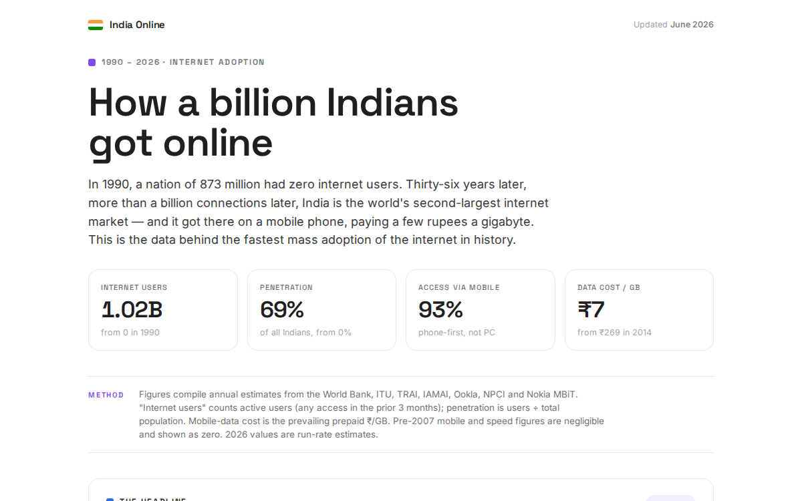
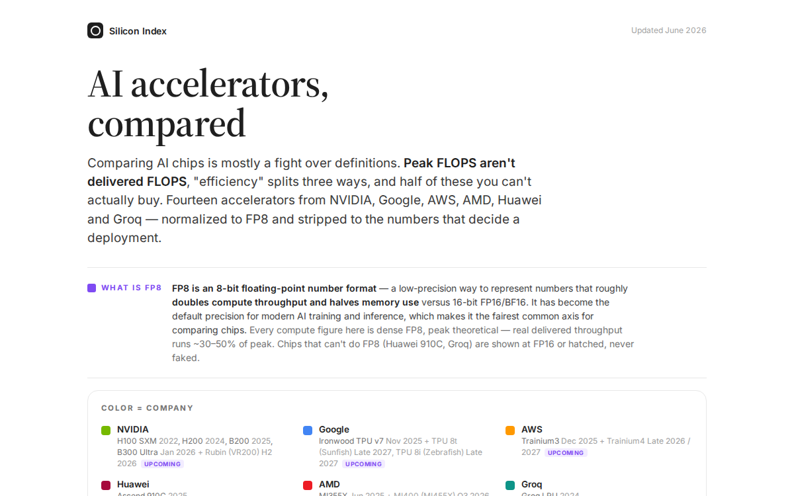
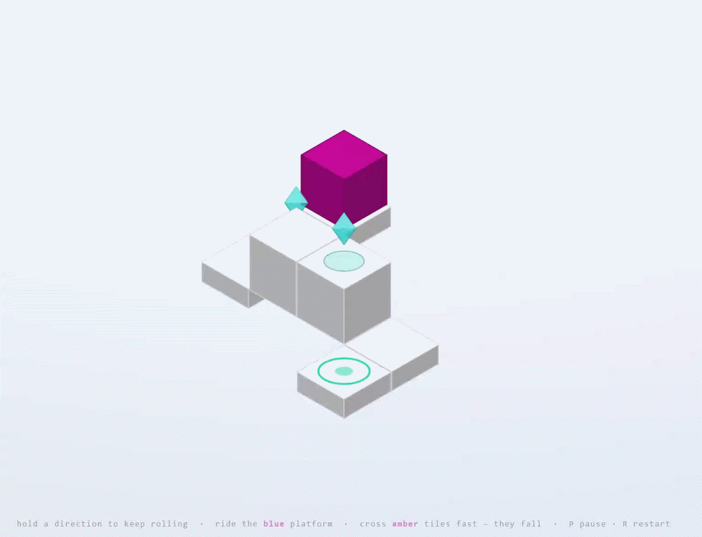
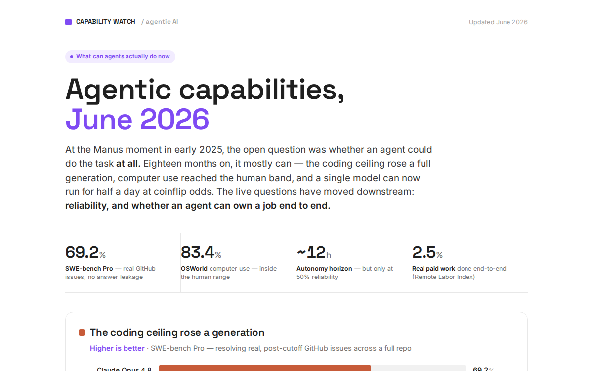
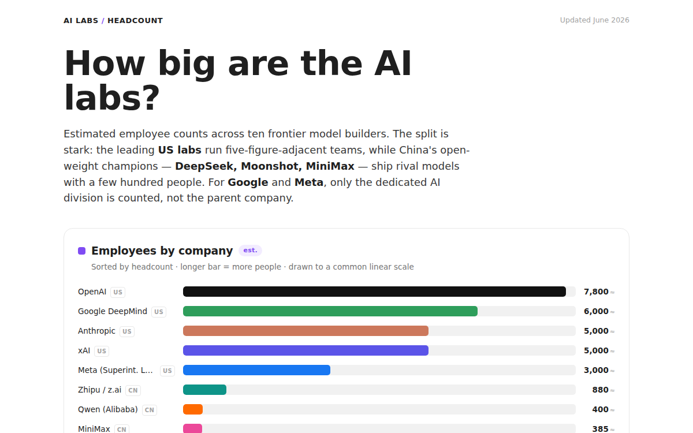
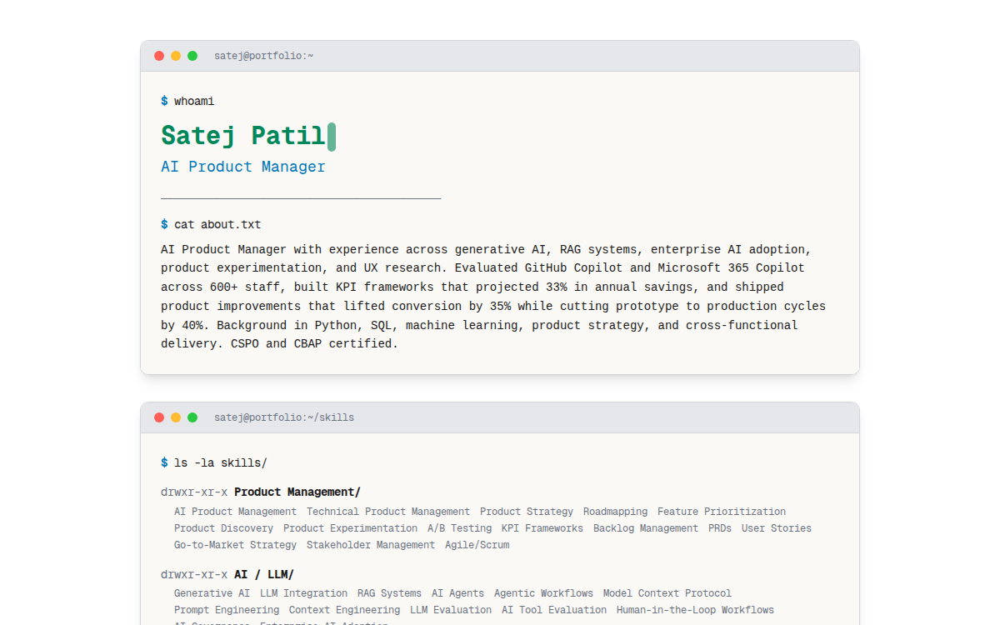
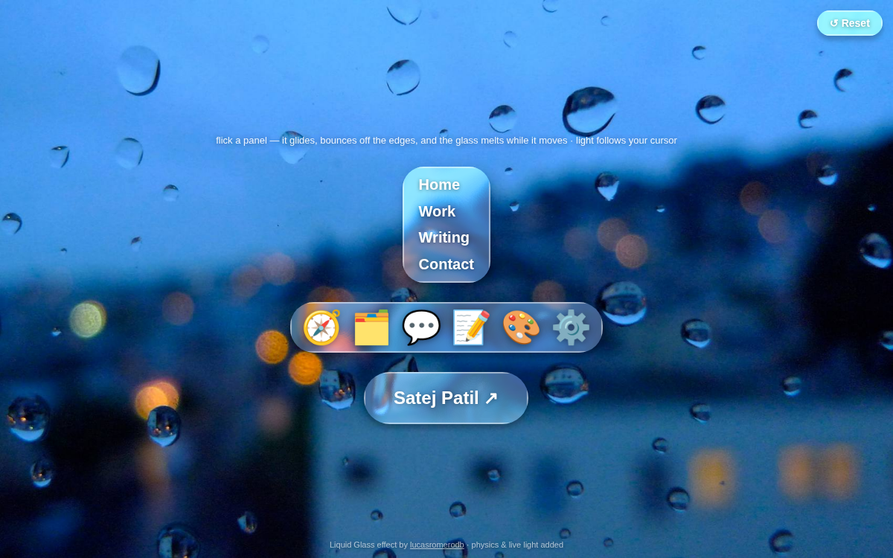

# Claude Infographics

A home for visual work produced by Claude — **infographics, data visualizations, and Claude designs**.

This repo is a publishing space: finished pieces get pushed here and indexed below. Works can be
single HTML/MHTML files, images, GIFs, or whole site folders for more complex builds. HTML works are
served live via **GitHub Pages** so you can view them rendered, not just as source.

🔗 **Live site:** https://satejp10.github.io/claude-works/

## Gallery

<!-- GALLERY:START -->
<table>
  <tr>
    <td width="50%" align="center" valign="top"> <b>How India Got Online — Pixel Quest</b></td>
    <td width="50%" align="center" valign="top"> <b>India Online — How a Billion Got Connected</b></td>
  </tr>
  <tr>
    <td width="50%" align="center" valign="top"> <b>AI Engines, What Runs Your AI?</b></td>
    <td width="50%" align="center" valign="top"> <b>EDGE — Browser Recreation</b></td>
  </tr>
  <tr>
    <td width="50%" align="center" valign="top"> <b>Agentic Capabilities</b></td>
    <td width="50%" align="center" valign="top"> <b>AI Labs, by Headcount</b></td>
  </tr>
  <tr>
    <td width="50%" align="center" valign="top"> <b>Terminal Portfolio</b></td>
    <td width="50%" align="center" valign="top"> <b>Liquid Glass — Design Trials</b></td>
  </tr>
</table>
<!-- GALLERY:END -->

_Thumbnails above are generated automatically from the works below — see [Adding a work](#adding-a-work)._

## Works

| Work | Type | Date | Links |
|------|------|------|-------|
| **How India Got Online — Pixel Quest** — an interactive, gamified scrollytelling quest through the story of India's internet adoption. *(Completely overhauled rebuild.)* | Interactive (HTML) | Jun 2026 | [View](https://satejp10.github.io/claude-works/claude-design-works/how-india-got-online-pixel-quest.html) · [Source](claude-design-works/how-india-got-online-pixel-quest.html) · [Thumb](assets/thumbnails/how-india-got-online-pixel-quest.gif) |
| **India Online — How a Billion Got Connected** — the standalone data report: the charts and numbers behind India's path from a handful of users to a billion connected. | Data report (HTML) | Jun 2026 | [View](https://satejp10.github.io/claude-works/claude-design-works/india-online-data-report.html) · [Source](claude-design-works/india-online-data-report.html) |
| **AI Engines, What Runs Your AI?** — what's actually powering today's models: FP8 compute-per-watt vs. memory bandwidth across 2026 AI chips, normalized to comparable definitions. | Infographic (HTML) | Jun 2026 | [View](https://satejp10.github.io/claude-works/claude-design-works/ai-accelerators-2026.html) · [Source](claude-design-works/ai-accelerators-2026.html) |
| **EDGE — Browser Recreation** — a playable, hand-rolled recreation of the 2008 puzzle-platformer EDGE: roll an isometric cube across tile levels collecting prisms, with fixed-timestep physics in vanilla JS + Canvas 2D (desktop keyboard + mobile touch). Lives in its [own repo](https://github.com/Satejp10/EDGE). | Game (JS/Canvas) | Jun 2026 | [View](https://satejp10.github.io/EDGE/) · [Source](https://github.com/Satejp10/EDGE) · [Thumb](assets/thumbnails/edge.gif) |
| **Agentic Capabilities** — how far agents got by mid-2026: METR task-completion time horizons, the coding ceiling, and computer use crossing into the human band. | Infographic (HTML) | Jun 2026 | [View](https://satejp10.github.io/claude-works/claude-design-works/agentic-capabilities-june-2026.html) · [Source](claude-design-works/agentic-capabilities-june-2026.html) |
| **AI Labs, by Headcount** — estimated employee counts across ten frontier model builders: lean, five-figure-adjacent US teams vs. a few hundred people at China's open-weight leaders. | Infographic (HTML) | Jun 2026 | [View](https://satejp10.github.io/claude-works/claude-design-works/ai-lab-headcount.html) · [Source](claude-design-works/ai-lab-headcount.html) |
| **Terminal Portfolio** — a terminal-styled personal portfolio for an AI product manager: skills, experience, and metrics laid out as shell commands (whoami, ls, git log, systemstats), with CRT scanlines and an inline-embedded font. | Portfolio (HTML) | Jun 2026 | [View](https://satejp10.github.io/claude-works/claude-design-works/terminal-portfolio.html) · [Source](claude-design-works/terminal-portfolio.html) |
| **Liquid Glass — Design Trials** — interactive glass-morphism design experiments (flick, drag, refract). | Design experiment (HTML) | Jun 2026 | [View](https://satejp10.github.io/claude-works/claude-design-works/glass-morphism-design-trials.html) · [Source](claude-design-works/glass-morphism-design-trials.html) |

## Structure

- [`claude-design-works/`](claude-design-works/) — design pieces and visual artifacts produced by Claude.

## Adding a work

1. Drop the file (or folder) into `claude-design-works/`.
2. Add a row to the **Works** table above — name, type, date, and a `View` (live Pages URL) + `Source` link.
3. Commit and push. The Pages site updates automatically.

The **Gallery** thumbnails are generated automatically: a [GitHub Actions workflow](.github/workflows/thumbnails.yml)
renders each work in the Works table, writes a thumbnail to `assets/thumbnails/`, and rebuilds the gallery
block — so you never edit thumbnails by hand. Just add the table row; the picture follows on the next push.
To regenerate locally, run `node .github/scripts/gen-thumbnails.mjs` (needs `npm install playwright`).

**Custom or animated thumbnails / external projects.** Add a `Thumb` link to the row pointing at an
image you've committed under `assets/thumbnails/` — e.g. `· [Thumb](assets/thumbnails/my-work.gif)`. When a
`Thumb` is present the generator uses that image as-is and skips rendering, so you can use an animated GIF
instead of a static screenshot. This also lets you list a project that lives in **another repo**: give the
row a `View` link to its live demo, point `Source` at that repo, and supply a `Thumb` (no
`claude-design-works/` file needed). To rebuild only the gallery block without rendering, run
`SKIP_RENDER=1 node .github/scripts/gen-thumbnails.mjs` (no Playwright required).
