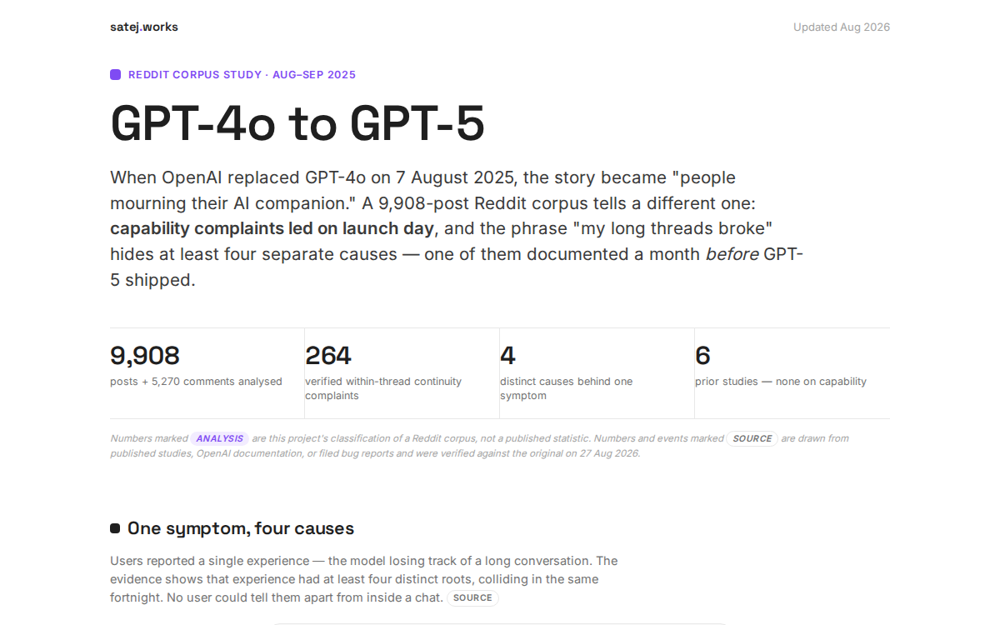
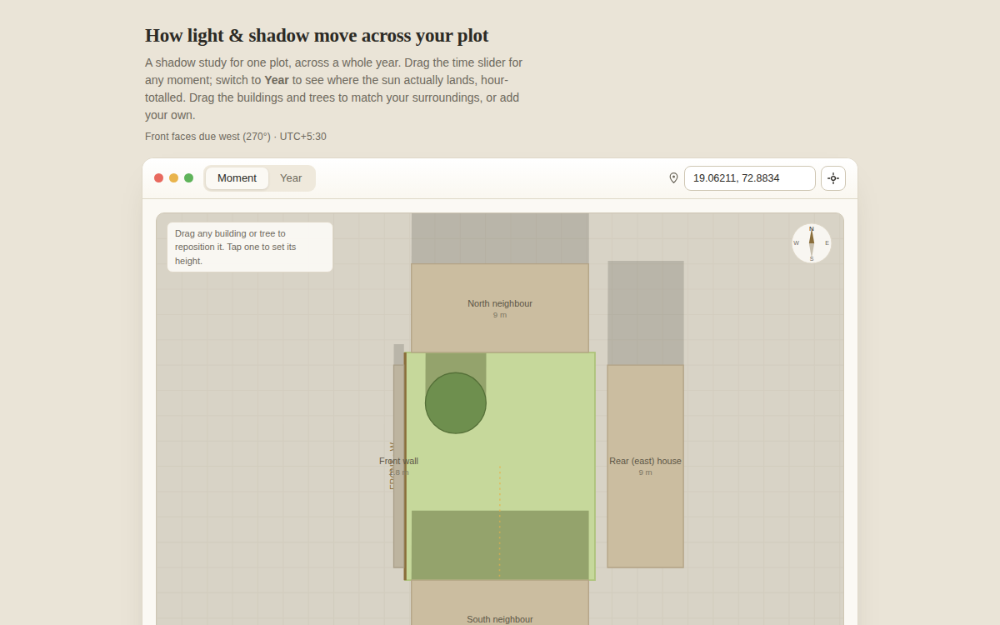
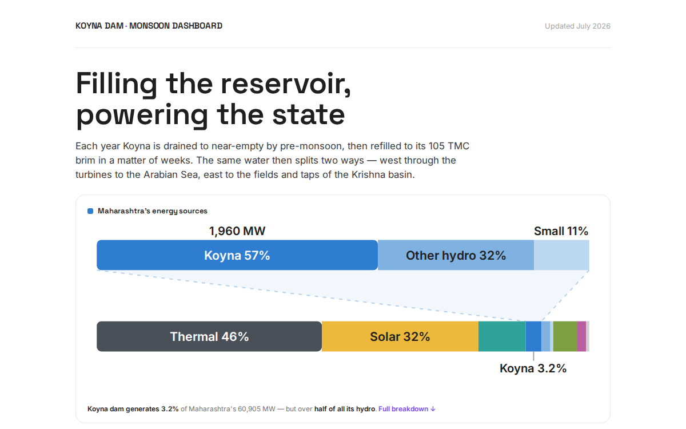
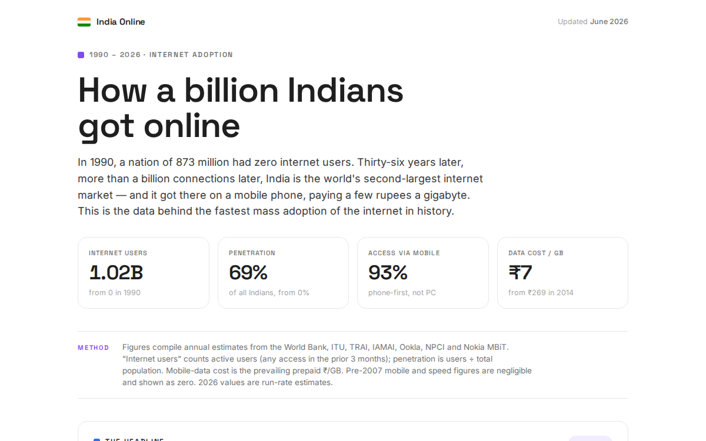
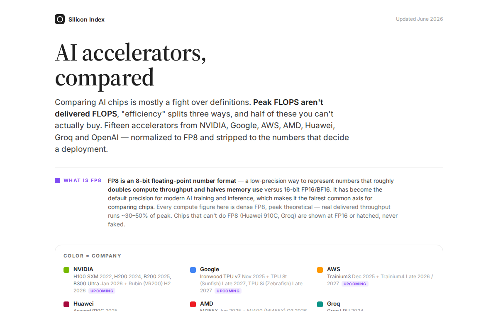
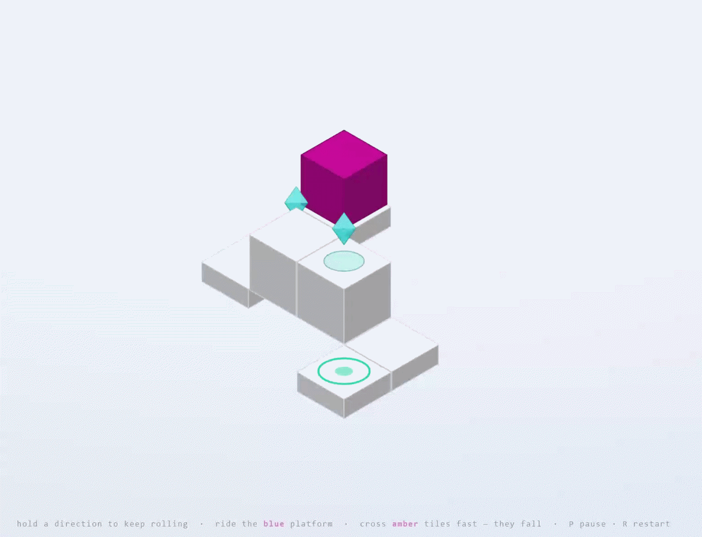
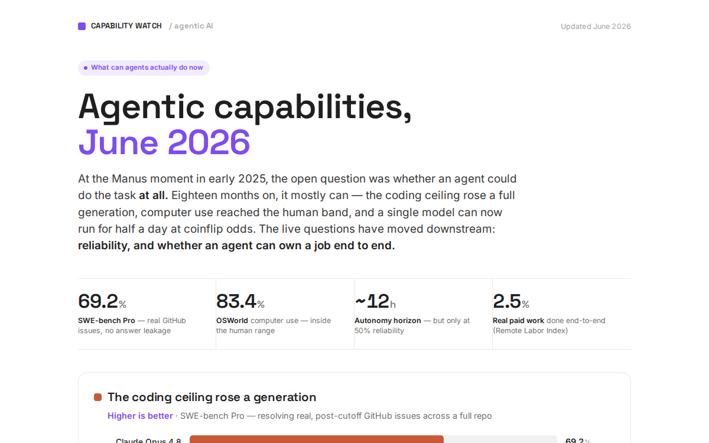
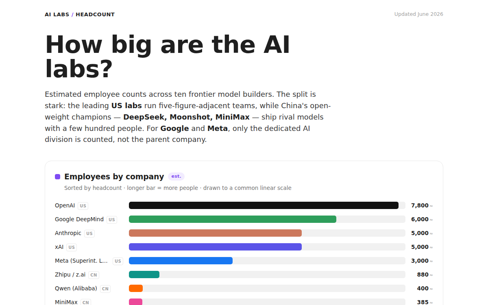
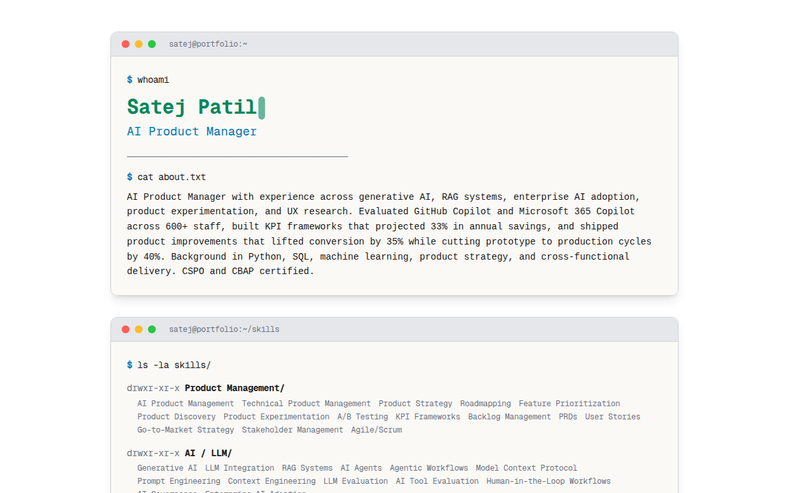
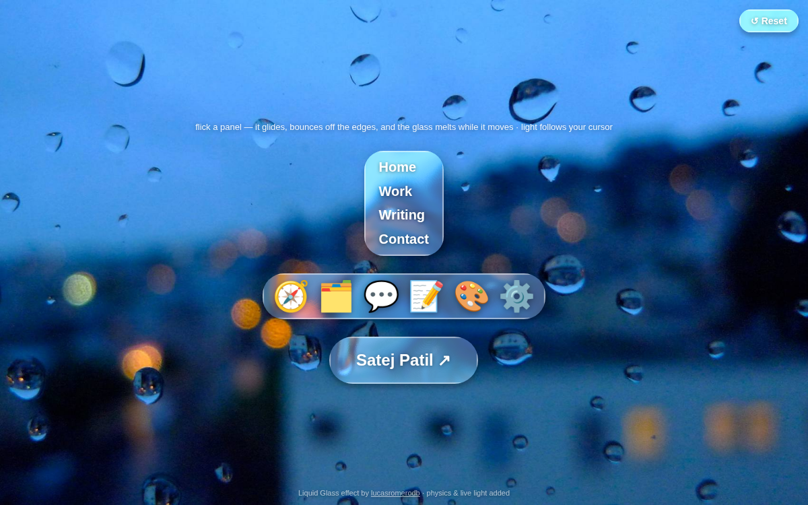

# Claude Infographics

A home for visual work produced by Claude — **infographics, data visualizations, and Claude designs**.

This repo is a publishing space: finished pieces get pushed here and indexed below. Works can be
single HTML/MHTML files, images, GIFs, or whole site folders for more complex builds. HTML works are
served live via **GitHub Pages** so you can view them rendered, not just as source.

🔗 **Live site:** https://satejp10.github.io/claude-works/

## Gallery

<!-- GALLERY:START -->
<table>
  <tr>
    <td width="50%" align="center" valign="top"> <b>The GPT-5 Backlash Wasn't Mostly About Grief</b></td>
    <td width="50%" align="center" valign="top"> <b>Plot Light Study</b></td>
  </tr>
  <tr>
    <td width="50%" align="center" valign="top"> <b>Koyna Dam — Monsoon Water & Power</b></td>
    <td width="50%" align="center" valign="top"> <b>How India Got Online — Pixel Quest</b></td>
  </tr>
  <tr>
    <td width="50%" align="center" valign="top"> <b>India Online — How a Billion Got Connected</b></td>
    <td width="50%" align="center" valign="top"> <b>AI Engines, What Runs Your AI?</b></td>
  </tr>
  <tr>
    <td width="50%" align="center" valign="top"> <b>EDGE — Browser Recreation</b></td>
    <td width="50%" align="center" valign="top"> <b>Agentic Capabilities</b></td>
  </tr>
  <tr>
    <td width="50%" align="center" valign="top"> <b>AI Labs, by Headcount</b></td>
    <td width="50%" align="center" valign="top"> <b>Terminal Portfolio</b></td>
  </tr>
  <tr>
    <td width="50%" align="center" valign="top"> <b>Liquid Glass — Design Trials</b></td>
  </tr>
</table>
<!-- GALLERY:END -->

_Thumbnails above are generated automatically from the works below — see [Adding a work](#adding-a-work)._

## Works

<!-- LOG — external works (read before editing this table):
     Some rows are hosted in OTHER repos, not under works/. They use
     the [Thumb] pattern (a hand-captured screenshot committed to assets/thumbnails/)
     and are NOT auto-rendered. Because adding/removing one only touches README.md +
     assets/, it does NOT match thumbnails.yml's paths filter, so the workflow will
     not auto-run — rebuild the gallery locally with
       SKIP_RENDER=1 node .github/scripts/gen-thumbnails.mjs
     (and, to mirror to the satejp10 profile, trigger the workflow manually so the
     sync-landing.mjs step runs). External entries currently in the gallery:
       - EDGE — Browser Recreation  →  https://github.com/Satejp10/EDGE
       - Plot Light Study           →  https://github.com/Satejp10/Sun-light-shadow-plot
     Snapshot for Plot Light Study captured 2026-07-12 at 1200x750 from the live site. -->

| Work | Type | Date | Links |
|------|------|------|-------|
| **The Switch Matrix** — a visual reading of arXiv 2603.03111 (NatWest AI Research + UCL): measuring performance drift when a deployed LLM system swaps models mid-conversation. Interactive 9×9 handoff matrices show even a single mid-conversation model switch can move outcomes by up to 13 points. | Infographic (HTML) | Aug 2026 | [View](https://satejp10.github.io/claude-works/works/model-switching-drift.html) · [Source](works/model-switching-drift.html) |
| **The GPT-5 Backlash Wasn't Mostly About Grief** — a 9,908-post Reddit corpus study of the Aug 2025 GPT-4o→GPT-5 transition: capability complaints led on launch day, and the single "long threads broke" symptom resolves into four distinct causes — one filed a month before GPT-5 shipped. | Infographic (HTML) | Aug 2026 | [View](https://satejp10.github.io/claude-works/works/gpt5-transition-reddit.html) · [Source](works/gpt5-transition-reddit.html) |
| **Plot Light Study** — an interactive shadow study for a single plot across a whole year: drag the time slider for any moment, or switch to a full-year view to see where the sun actually lands (hour-totalled), dragging buildings and trees to match your surroundings. Lives in its [own repo](https://github.com/Satejp10/Sun-light-shadow-plot). | Interactive (HTML) | Jul 2026 | [View](https://satejp10.github.io/Sun-light-shadow-plot/Solar%20light%20study.html) · [Source](https://github.com/Satejp10/Sun-light-shadow-plot) · [Thumb](assets/thumbnails/sun-light-shadow-plot.png) |
| **Koyna Dam — Monsoon Water & Power** — how Shivsagar Lake refills through the monsoon and what it powers: reservoir level against gross capacity from the pre-monsoon low, set against Maharashtra's energy mix. | Dashboard (HTML) | Jul 2026 | [View](https://satejp10.github.io/claude-works/works/koyna-monsoon-dashboard.html) · [Source](works/koyna-monsoon-dashboard.html) |
| **How India Got Online — Pixel Quest** — an interactive, gamified scrollytelling quest through the story of India's internet adoption. *(Completely overhauled rebuild.)* | Interactive (HTML) | Jun 2026 | [View](https://satejp10.github.io/claude-works/works/how-india-got-online-pixel-quest.html) · [Source](works/how-india-got-online-pixel-quest.html) · [Thumb](assets/thumbnails/how-india-got-online-pixel-quest.gif) |
| **India Online — How a Billion Got Connected** — the standalone data report: the charts and numbers behind India's path from a handful of users to a billion connected. | Data report (HTML) | Jun 2026 | [View](https://satejp10.github.io/claude-works/works/india-online-data-report.html) · [Source](works/india-online-data-report.html) |
| **AI Engines, What Runs Your AI?** — what's actually powering today's models: FP8 compute-per-watt vs. memory bandwidth across 2026 AI chips, normalized to comparable definitions. | Infographic (HTML) | Jun 2026 | [View](https://satejp10.github.io/claude-works/works/ai-accelerators-2026.html) · [Source](works/ai-accelerators-2026.html) |
| **EDGE — Browser Recreation** — a playable, hand-rolled recreation of the 2008 puzzle-platformer EDGE: roll an isometric cube across tile levels collecting prisms, with fixed-timestep physics in vanilla JS + Canvas 2D (desktop keyboard + mobile touch). Lives in its [own repo](https://github.com/Satejp10/EDGE). | Game (JS/Canvas) | Jun 2026 | [View](https://satejp10.github.io/EDGE/) · [Source](https://github.com/Satejp10/EDGE) · [Thumb](assets/thumbnails/edge.gif) |
| **Agentic Capabilities** — how far agents got by mid-2026: METR task-completion time horizons, the coding ceiling, and computer use crossing into the human band. | Infographic (HTML) | Jun 2026 | [View](https://satejp10.github.io/claude-works/works/agentic-capabilities-june-2026.html) · [Source](works/agentic-capabilities-june-2026.html) |
| **AI Labs, by Headcount** — estimated employee counts across ten frontier model builders: lean, five-figure-adjacent US teams vs. a few hundred people at China's open-weight leaders. | Infographic (HTML) | Jun 2026 | [View](https://satejp10.github.io/claude-works/works/ai-lab-headcount.html) · [Source](works/ai-lab-headcount.html) |
| **Terminal Portfolio** — a terminal-styled personal portfolio for an AI product manager: skills, experience, and metrics laid out as shell commands (whoami, ls, git log, systemstats), with CRT scanlines and an inline-embedded font. | Portfolio (HTML) | Jun 2026 | [View](https://satejp10.github.io/claude-works/works/terminal-portfolio.html) · [Source](works/terminal-portfolio.html) |
| **Liquid Glass — Design Trials** — interactive glass-morphism design experiments (flick, drag, refract). | Design experiment (HTML) | Jun 2026 | [View](https://satejp10.github.io/claude-works/works/glass-morphism-design-trials.html) · [Source](works/glass-morphism-design-trials.html) |

## Structure

- [`works/`](works/) — design pieces and visual artifacts produced by Claude.

## Adding a work

1. Drop the file (or folder) into `works/`.
2. Add a row to the **Works** table above — name, type, date, and a `View` (live Pages URL) + `Source` link.
3. Commit and push. The Pages site updates automatically.

The **Gallery** thumbnails are generated automatically: a [GitHub Actions workflow](.github/workflows/thumbnails.yml)
renders each work in the Works table, writes a thumbnail to `assets/thumbnails/`, and rebuilds the gallery
block — so you never edit thumbnails by hand. Just add the table row; the picture follows on the next push.
To regenerate locally, run `node .github/scripts/gen-thumbnails.mjs` (needs `npm install playwright`).

**Custom or animated thumbnails / external projects.** Add a `Thumb` link to the row pointing at an
image you've committed under `assets/thumbnails/` — e.g. `· [Thumb](assets/thumbnails/my-work.gif)`. When a
`Thumb` is present the generator uses that image as-is and skips rendering, so you can use an animated GIF
instead of a static screenshot. This also lets you list a project that lives in **another repo**: give the
row a `View` link to its live demo, point `Source` at that repo, and supply a `Thumb` (no
`works/` file needed). To rebuild only the gallery block without rendering, run
`SKIP_RENDER=1 node .github/scripts/gen-thumbnails.mjs` (no Playwright required).

<!-- visit-beacon:start -->

<!-- visit-beacon:end -->
